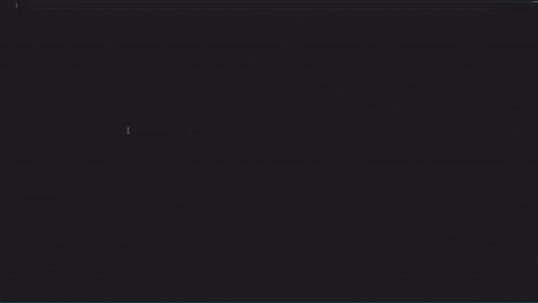

# Pixel Pizza Snippets

**Note:** This extension is generally used for Pixel Pizza bot developers, but the code can be edited afterwards to work for your own bot

## Features

You can use ppcom or ppcommand to make a command

## Requirements

You will need to have a basic discord.js bot with a command handler

## Release Notes

### 1.0.0
Initial release of Pixel Pizza snippets 

* added snippets command
* added _ppcom_ and _ppcommand_ snippet for javascript
* added _ppcom_ and _ppcommand_ snippet for typescript

### 1.1.0

* removed needVip property from command snippet for javascript
* removed needVip property from command snippet for typescript

### 1.2.0

* added _ppembed_ and _ppembedoptions_ snippet for javascript
* added _ppembed_ and _ppembedoptions_ snippet for typescript

### 1.3.0

* added _ppclass_ snippet for java
* added _ppclassvalue_ and _ppclassval_ snippet for java
* added _ppclassmethod_, _ppclassfunc_ and _ppclassfunction_ snippet for java
* added _ppcon_, _ppconstructor_ snippet for java
* added _ppenum_ snippet for java
* added _ppinterface_ snippet for java

### 1.4.0
nothing happend, just updated by accident

**Enjoy!**
